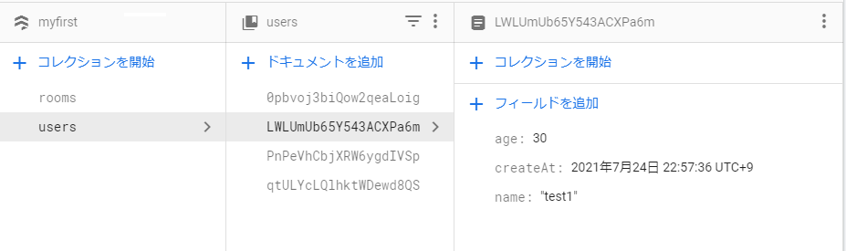

# create-react-appで作成したアプリをFirebase hostingにデプロイ + Cloud FirestoreのCRUDサンプル

## はじめに

* Firebaseのサイト上での初期設定は完了している前提
(適当なFirebaseプロジェクトが作成されていればよい)

下記ページ参考に、CRUDサンプルだけreactで書き直しています。
[[Firebase] Firestoreで読み書きする (Web編)](https://blog.katsubemakito.net/firebase/firestore_readwrite_1)


### 1. アプリを作成(テンプレートから変更せず動作確認のみ)

```bash
npx create-react-app firebase-deploy --template typescript
cd  firebase-deploy
npm run start
```


### 2. firebase管理用コマンドインストール
```bash
npm install firebase
npm install -g firebase-tools
```

ターミナルからログイン(未ログイン状態の場合、ブラウザが開くのでログインを行う)

```bash
firebase login
```

### 3. firebaseのローカル側設定を行う

```bash
$ firebase init

     ######## #### ########  ######## ########     ###     ######  ########
     ##        ##  ##     ## ##       ##     ##  ##   ##  ##       ##
     ######    ##  ########  ######   ########  #########  ######  ######
     ##        ##  ##    ##  ##       ##     ## ##     ##       ## ##
     ##       #### ##     ## ######## ########  ##     ##  ######  ########

You're about to initialize a Firebase project in this directory:

  C:\Users\t_nii\Documents\git\firebase\firebase-deploy

? Are you ready to proceed? Yes
? Which Firebase features do you want to set up for this directory? Press Space to select features, then Enter to confirm your choices. Hosting: Configure files for Firebase Hosting and (optionally) set up GitHub 
Action deploys

=== Project Setup

First, let's associate this project directory with a Firebase project.
You can create multiple project aliases by running firebase use --add,
but for now we'll just set up a default project.

? Please select an option: Use an existing project
? Select a default Firebase project for this directory: myfirstproject-xxxxx (myFirstProject)
i  Using project myfirstproject-xxxxx (myFirstProject)

=== Hosting Setup

Your public directory is the folder (relative to your project directory) that
will contain Hosting assets to be uploaded with firebase deploy. If you
have a build process for your assets, use your build's output directory.

? What do you want to use as your public directory? build
? Configure as a single-page app (rewrite all urls to /index.html)? Yes
? Set up automatic builds and deploys with GitHub? No
+  Wrote build/index.html

i  Writing configuration info to firebase.json...
i  Writing project information to .firebaserc...

+  Firebase initialization complete!
```

### 4. プロジェクトのbuildを行う

通常通りbuildを行う(deployを行うためのbuildフォルダを作成する)

```bash
npm run build
```


### 5. firebaseへデプロイを行う

```bash
$ firebase deploy

=== Deploying to 'myfirstproject-xxxxx'...

i  deploying hosting
i  hosting[myfirstproject-xxxxx]: beginning deploy...
i  hosting[myfirstproject-xxxxx]: found 19 files in build
+  hosting[myfirstproject-xxxxx]: file upload complete
i  hosting[myfirstproject-xxxxx]: finalizing version...
+  hosting[myfirstproject-xxxxx]: version finalized
i  hosting[myfirstproject-xxxxx]: releasing new version...
+  hosting[myfirstproject-xxxxx]: release complete

+  Deploy complete!

Project Console: https://console.firebase.google.com/project/myfirstproject-xxxxx/overview
Hosting URL: https://myfirstproject-xxxxx.web.app
```
コンソールに表示されたURLを開くと、reactのアプリが表示されます。


## CRUD確認用プログラム

* firebaseコンソールから「ウェブアプリ」を追加し、`SDKの設定と構成`から接続設定(firebaseConfig)を取得します。


* 接続設定(firebaseConfig.ts)

取得した設定を元に、dbオブジェクトを生成してエクスポートします。

```typescript
import firebase from 'firebase';

const firebaseConfig = {
  apiKey: "xxxxxxx",
  authDomain: "xxxxxxx.firebaseapp.com",
  projectId: "xxxxxxx",
  storageBucket: "xxxxxxx.com",
  messagingSenderId: "xxxxxxx",
  appId: "xxxxxxx"
};

const firebaseApp = firebase.initializeApp(firebaseConfig);
const db = firebaseApp.firestore();
const auth = firebaseApp.auth();

export { auth };
export default db;

```

* CRUDサンプルプログラム(CRUDSample.tsx)

```tsx
import React, {useState} from 'react';
import db from './firebaseConfig';

function CRUDSample() {
  const [name, setName] = useState('');
  const [docId, setDocId] = useState('');
  const [debugLog, setDebugLog] = useState('');
  const create = async () => {  
    const data = {
      name: name,
      age: Math.trunc(Math.random() * 100),
      createAt: new Date(),      
    }
    await db.collection('users').add(data);
    await readAll();
  };

  const read = async () => {  
    const docRef = db.collection('users').doc(docId);
    const doc = await docRef.get();
    if (doc.exists) {
      console.log(doc.data());
    } else {
      console.log('not found');
    }
  };

  const del = async () => {
    try{
      await db.collection('users').doc(docId).delete(); 
      await readAll();
    } catch (e) {
      console.log(e);
    }
    
  }

  const update = async () => {
    try {
      const doc = await db.collection("users").doc(docId).get();
      await db.collection("users").doc(docId).set({
          ...doc.data(),
          name: name,
      });
      await readAll();
    } catch (e) {
      console.log(e);
    }
  };

  const readAll = async () => {  
    const docRef = db.collection('users').orderBy('createAt', 'desc');
    const snapShot = await docRef.get();
    const dataArray = [] as any[];
    snapShot.forEach( doc => {
      dataArray.push({
        id: doc.id,
        ...doc.data(),
      });
    });
    
    setDebugLog(JSON.stringify(dataArray, null, '  '));
  };
  
  return (
    <>
      <p>
        name:<input type="text" value={name} onChange={e => setName(e.target.value)} />
        <button onClick={create}>Create</button>
      </p>
      <p>
        id:<input type="text" value={docId} onChange={e => setDocId(e.target.value)} />
        <button onClick={read}>Read</button>
      </p>
      <p>
        id:<input type="text" value={docId} onChange={e => setDocId(e.target.value)} />
        <button onClick={del}>Delete</button>
      </p>           
      <p>
        id:<input type="text" value={docId} onChange={e => setDocId(e.target.value)} />
        name:<input type="text" value={name} onChange={e => setName(e.target.value)} />
        <button onClick={update}>update</button>
      </p>
      <p>
        <button onClick={readAll}>readAll</button>
      </p>
      <p><textarea value={debugLog} readOnly style={{width:'600px', height: '500px'}} /></p>
    </>
  )
}

export default CRUDSample;
```


* App.tsx を下記のように書き換えて動作確認を行います

```tsx
import CRUDSample from './CRUDSample';

function App() {
  return (
    <div className="App">
      <CRUDSample />
    </div>
  );
}

export default App;
```


* 登録したデータはコンソールからこのようなイメージで登録されます。




## 参考ページ

* [FirebaseでWebアプリをデプロイする方法](https://yoheiko.com/?p=769)

* [[Firebase] プロジェクトを新規に作成する](https://blog.katsubemakito.net/firebase/firebase-make-newproject)

* [[Firebase] Firestoreで読み書きする (Web編)](https://blog.katsubemakito.net/firebase/firestore_readwrite_1)
